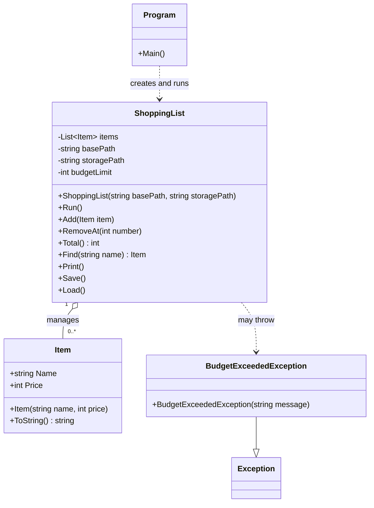

# UML Class Diagram

```mermaid
classDiagram
    class Program {
        +Main()
    }

    class ShoppingList {
        -List~Item~ items
        -string basePath
        -string storagePath
        -int budgetLimit
        +ShoppingList(string basePath, string storagePath)
        +Run()
        +Add(Item item)
        +RemoveAt(int number)
        +Total() int
        +Find(string name) Item
        +Print()
        +Save()
        +Load()
    }

    class Item {
        +string Name
        +int Price
        +Item(string name, int price)
        +ToString() string
    }

    class BudgetExceededException {
        +BudgetExceededException(string message)
    }

    Program ..> ShoppingList : creates and runs
    ShoppingList "1" o-- "0..*" Item : manages
    ShoppingList ..> BudgetExceededException : may throw
    BudgetExceededException --|> Exception
```
